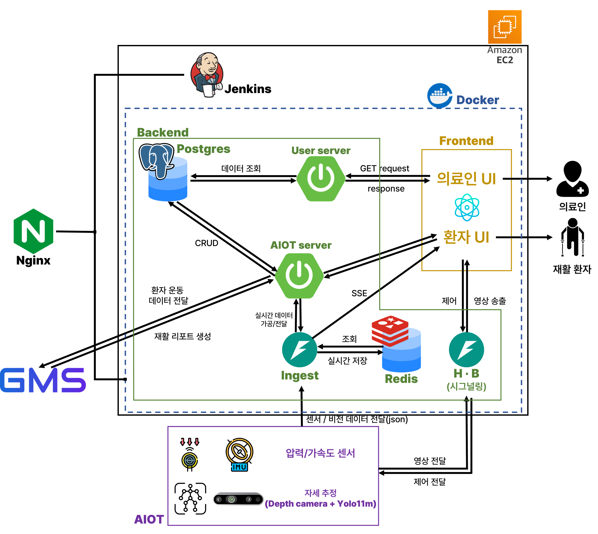

# 행가래 (行家來)

### AI 기반 재활 운동 치료 보조 시스템

> **"환자들의 집으로 가는 발걸음을 더 가볍고, 안전하게"**
> 병원에서 집으로, 더 빠르고 안전한 회복을 돕는 자율 재활 플랫폼


##  서비스 한눈에 보기

* **서비스명**: 행가래 (行家來)
* **형태**: 병원 설치형 AI 재활 운동 보조 시스템
* **핵심 가치**: 자율성 · 정확성 · 지속성
* [발표 자료](AIoT_재활운동보조_발표자료.pdf)

  


## 파트별 역할 분담

* **AI Vision**: Pose 모델 학습·경량화·추론 최적화
* **Backend**: 재활 도메인 모델링·평가 기준 설계·API
* **Frontend**: 환자 친화 UI·실시간 시각화·대시보드
* **Edge / IoT**: 센서 수집·실시간 파이프라인·지연 최소화

### 주요 기여 - AIoT / Edge Interface

* 센서-엣지 장비-서버 간 데이터 인터페이스 설계 및 구현
* Arduino 기반 Load Cell 센서값 전처리 및 UDP JSON 송신 구조 구현
* Jetson에서 IMU/Load Cell UDP 데이터를 비동기 수신하고 카메라 프레임 기준으로 동기화
* YOLO Pose TensorRT 추론 결과, Depth 기반 3D 좌표, 센서 지표를 frame payload로 구조화
* 평가용 데이터는 REST Ingest API와 Redis 집계 구조로 전송하고, 실시간 영상은 WebRTC로 분리 스트리밍
* ONNX/TensorRT 변환 및 Jetson Edge 추론 파이프라인 연동

## 1. 서비스 소개

### 서비스명 의미

**행가래 (行家來)**

치료사 없이도 환자가 **스스로 올바른 재활 운동을 수행**할 수 있도록 돕는 것을 목표로 한다.


## 2. 기획 배경

* 재활 치료는 **반복성·정확성·지속성**이 핵심
* 치료 인력 부족으로 치료 공백 발생
* 치료사 개입이 줄어드는 구간에서

  * 운동 품질 저하
  * 환자 이탈 증가

👉 치료사의 **판단 기준을 구조화·정량화**해 시스템으로 이전할 필요

행가래는 Vision + Sensor + AI를 결합해 **치료사의 판단 구조를 디지털 재활 프로토콜로 구현**한다.


## 3. 핵심 컨셉

* 🧠 **자율 재활**: 치료사 부재 상황에서도 기준 기반 운동 수행
* ⚡ **실시간 피드백**: Try 단위 실시간 성공·실패 판단
* 🩺 **의료진 리포트**: 치료사가 즉시 이해 가능한 결과 제공


## 4. 핵심 기능

### 4-1. AI Vision 기반 자세 인식

* RGB / Depth 카메라 입력
* YOLO Pose 기반 관절 추정
* 관절 각도, 거리 계산

### 4-2. Sensor 기반 보조 지표 수집

* Load Cell (압력 센서): 체중 분포·좌우 균형
* IMU (가속도 센서): 즉각적인 속도 변화 감지를 통한 움직임 안정성 판단

### 4-3. 운동 평가 로직

* **Try / Session / Sequence 구조**
* Vision + Sensor 지표 통합 평가
* 실패 원인 자동 분류

### 4-4. 실시간 피드백

* 화면 기반 시각 피드백
* 음성 기반 운동 가이드 및 결과 안내

### 4-5. 의료진 리포트 자동 생성

* Sequence / Session 요약
* 성공률, 평균 점수, 실패 패턴
* LLM 기반 자연어 요약


## 5. 전체 아키텍처 개요


### 시스템 구성

**① Edge Device (AIoT)**

* 카메라·센서 입력
* 실시간 Pose 추정
* Jetson Orin Nano / Intel Realsense (depth camera)

**② Backend Server**

* 운동 결과 수집
* 평가 로직 수행
* 리포트 데이터 생성

**③ Frontend**

* 환자 운동 화면
* 치료사 대시보드
* 실시간 피드백 처리


## 6. 폴더 구조

```
S14P11A203/
├── server/                         # 서버 · 프론트엔드 · 배포 구성
│   ├── backend/                    # Spring Boot 멀티모듈 API 서버
│   │   ├── common-db/              # JPA Entity · Repository 공통 모듈
│   │   ├── backend-iot/            # IoT/운동 평가 API
│   │   └── backend-user/           # 사용자/치료사 조회 API
│   ├── ingest/                     # FastAPI 기반 실시간 frame ingest 서버
│   ├── frontend/                   # React · Vite 기반 환자/치료사 UI
│   ├── nginx/                      # Nginx reverse proxy 설정
│   └── docker-compose.yml          # DB, Redis, API, Frontend 배포 구성
│
├── aIoT/                           # Jetson Edge · 센서 · 실시간 융합 파이프라인
│   ├── aiot_rehab_system/          # Pose 추론, 센서 융합, WebRTC/REST 전송
│   ├── sensor_build/               # Arduino/PlatformIO 센서 펌웨어
│   ├── sensor_udp_test/            # UDP 센서 수신 테스트
│   ├── make_tensorrt/              # ONNX/TensorRT 변환 및 엔진 검증
│   └── startup_setup/              # Jetson 부팅/서비스 실행 설정
│
├── ai_vision/                      # AI Pose 모델 학습 · 데이터셋 · 실험
│   ├── 00_dataset/                 # COCO/HICO 데이터 필터링 및 분할
│   ├── 01_mmpose_labeling/         # MMPose 기반 pseudo labeling
│   ├── 02_yolo_m_teacher/          # YOLO11m-pose fine-tuning
│   └── 03_yolo_n_student/          # 경량 모델 실험 및 ONNX export
│
├── exec/                           # 배포 문서 · DB dump · 시연 시나리오
├── img/                            # README 및 문서용 이미지
└── README.md
```

## 7. 실행 방법

### Backend

```
cd backend
pip install -r requirements.txt
python manage.py runserver
```

### AIoT

```
aiot 실행 코드
```

### Frontend

```
cd frontend
npm install
npm run dev
```


## 8. USER FLOW

1. 환자 로그인 및 운동 선택
2. 센서 초기화 및 자세 인식
3. Try 단위 운동 수행
4. 실시간 피드백 제공
5. Session 종료
6. 치료사 리포트 확인


## 🔧 기술 스택

* **AI / Vision**: Python, PyTorch, YOLO Pose
* **Backend**: Spring Boot, Java
* **DB**: PostgreSQL, Redis
* **Frontend**: React, Vite
* **Edge**: Jetson, Python
* **LLM**: GPT 기반 요약 서비스
* **Infra**: Docker, GitLab CI/CD

---

