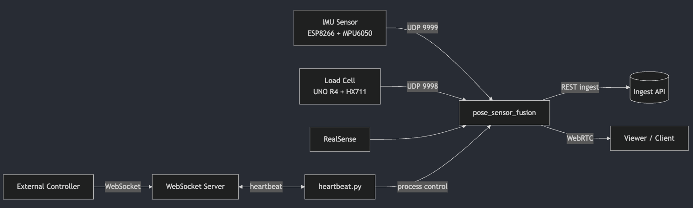

# aiot_rehab_system

본 저장소는 재활 운동 보조 AIoT 시스템 **행가래**의 메인 실행 패키지입니다.  
카메라 기반 자세 추정(3D)과 IMU, 로드셀 UDP 센서를 동기화하여  
데이터를 **외부 시스템으로 전송하는 것을 주 목적**으로 하며,  
기록 및 로컬 시각화 기능은 보조적으로 제공합니다.

---

## 시스템 개요

- 카메라 기반 2D, 3D 자세 추정
- IMU 및 로드셀 센서 UDP 수신
- 프레임 타임스탬프 기준 센서 융합
- **REST ingest 및 WebRTC 기반 실시간 데이터 전송**
- NDJSON 로그 저장 및 로컬 시각화(디버깅, 분석용)
- 외부 디바이스에서 실행을 제어할 수 있는 원격 제어 인터페이스 제공

---

## 디렉터리 구성

- `pose_sensor_fusion/`  
  메인 실행 모듈입니다. 카메라, IMU, 로드셀 데이터를 수집하고 융합합니다.

- `configs/`  
  실행, 로그, 센서, 네트워크 관련 설정 파일을 관리합니다.

- `model_performance_test/`  
  YOLO 기반 2D 자세 추정 모델 성능 테스트 스크립트입니다.

---

## 실행 방식 개요

본 시스템은 다음 두 가지 방식으로 실행할 수 있습니다.

1. 디바이스 로컬에서 직접 실행
2. 외부 디바이스에서 WebSocket 기반으로 원격 실행 및 종료 제어

---

## 실행 흐름

1. `configs/pose_sensor_fusion/default.yaml`을 참고하여 `run.yaml`을 작성합니다.
2. 메인 실행 모듈(`rehab_start`)을 실행합니다.
3. 필요 시 외부 디바이스에서 WebSocket을 통해 실행 및 종료를 제어합니다.

---

## 외부 제어를 위한 Heartbeat 모듈

Heartbeat는 **디바이스 외부에서 메인 실행 프로세스를 제어하기 위한 모듈**입니다.  
WebSocket 서버와 지속적으로 연결을 유지하며,  
외부에서 전달되는 명령에 따라 `rehab_start`를 시작하거나 종료합니다.

- 제어 주체: 외부 시스템 또는 원격 클라이언트
- 제어 대상: 디바이스 내부의 `rehab_start` 프로세스
- 제어 방식: WebSocket 기반 명령(run, stop)

---

## Heartbeat 동작 흐름


- heartbeat는 디바이스 내부에서 실행되며 WebSocket 서버에 연결합니다.
- 연결이 끊길 경우 backoff 기반 재시도로 자동 재연결합니다.
- 외부에서 `run`, `stop` 명령을 보내면  
  heartbeat가 `rehab_start` 프로세스를 시작하거나 종료합니다.
- 이를 통해 디바이스에 직접 접근하지 않고도 안전한 원격 제어가 가능합니다.

---

## 설정 파일 구조

- 기본 설정  
  `configs/pose_sensor_fusion/default.yaml`

- 사용자 설정  
  `configs/pose_sensor_fusion/run.yaml`

### 주요 설정 항목

- `engine.path`  
  TensorRT 엔진 파일 경로

- `imu`  
  IMU UDP 수신 설정 (포트, 버퍼, 매칭 방식)

- `load_cell`  
  로드셀 UDP 수신 설정 (포트, 버퍼, 매칭 방식)

- `webrtc`  
  WebRTC 스트리밍 설정

- `ingest`  
  REST ingest 전송 설정 (주요 데이터 파이프라인)

- `heartbeat`  
  WebSocket 서버 주소 및 재연결 정책 설정

---

## 데이터 처리 흐름

### 입력

- RGB, Depth 카메라 (RealSense)
- IMU UDP (`strength`, 포트 9999)
- Load Cell UDP (`weight_kg`, 포트 9998)

### 처리

- 2D, 3D 자세 추정 및 OneEuro 필터링
- 프레임 타임스탬프 기준 IMU, 로드셀 데이터 매칭
  - nearest
  - interpolation
- 관절 각도, 기울기, 속도, 힘 계산

### 출력

- REST ingest 전송 (주요 데이터 파이프라인)
- WebRTC 스트리밍 (원격 모니터링 및 시각화)
- NDJSON 로그 저장 (`run_logger`, 디버깅 및 분석용)
- 로컬 시각화 (OpenCV, 개발 및 테스트용)

---

## 통신 구조 요약




---

## 로컬 로그 저장 및 오프라인 시각화 (서브 기능)

본 기능은 시스템 디버깅 및 실험 데이터 분석을 목적으로 제공됩니다.  
실시간 운영 환경에서는 외부 시스템으로의 데이터 전송이 주 목적입니다.

### NDJSON 로그 저장

```bash
# pwd : aiot_rehab_system/
python -m pose_sensor_fusion.app.run_logger
```

### 저장된 로그 재생 및 시각화

```bash
# pwd : aiot_rehab_system/
python -m pose_sensor_fusion.sync.post_visualize_json --input <path_to_ndjson>
```

- 재생 설정 파일 예시  
  `configs/pose_sensor_fusion/visualize_replay.yaml`

---

## 실행 방법

### 메인 실행 (로컬)

실행 전 TensorRT 엔진 경로 및 통신 URL이  
`run.yaml`에 올바르게 설정되어 있어야 합니다.

WebRTC 스트리밍을 사용하는 경우  
`local_vis`를 false로 설정하는 것을 권장합니다.

```bash
# pwd : aiot_rehab_system/
python -m pose_sensor_fusion.app.rehab_start
```

---

### 외부 제어용 Heartbeat 실행

Heartbeat는 외부 제어를 활성화하기 위해  
디바이스 내부에서 별도로 실행합니다.

```bash
# pwd : aiot_rehab_system/
python -m pose_sensor_fusion.app.heartbeat
```

---


## 상세 기술 문서 링크

각 모듈의 상세 구현 내용은 아래 문서를 참고합니다.

- [`pose_sensor_fusion`](./pose_sensor_fusion/README.md)
- [`configs`](./configs/README.md)
- [`model_performance_test`](./model_performance_test/README.md)